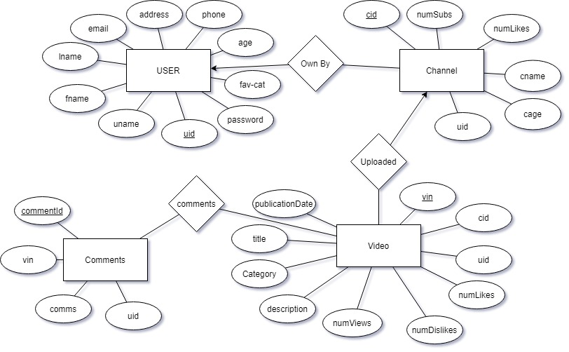

#Video-Based-Social-Media-Database-and-server
## project in CS 179G
By Sargis Abrahamyan and Luis Sanchez

## Purpose
The purpose of our project is to create a video sharing platform. Users are able to create accounts and upload their own videos to be watched by other users. Users are also able to like, dislike and add comments to the videos they had watched.  

## Major Components 
The three main components of the video sharing platform are a PostgreSQL database, HDFS server and a java application. The SQL database stores account information as well as metadata for the videos. The HDFS server stores the raw video data to be streamed to the user. We connect to the PostgreSQL database using a JDBC driver and WebHDFS to connect to the HDFS server with a java program serving as the interface for the user. 

## ER diagram for SQL server

